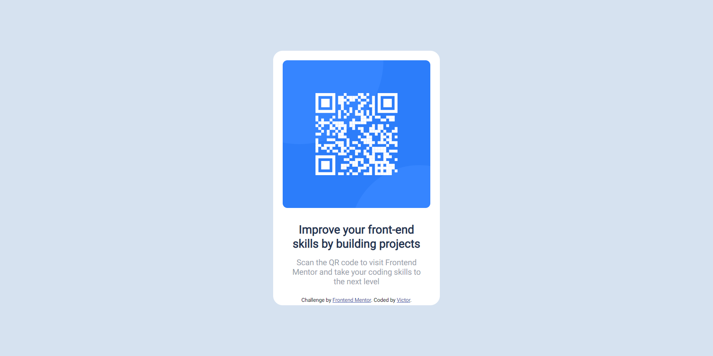

# Frontend Mentor - QR code component solution

This is a solution to the [QR code component challenge on Frontend Mentor](https://www.frontendmentor.io/challenges/qr-code-component-iux_sIO_H). Frontend Mentor challenges help you improve your coding skills by building realistic projects. 

## Table of contents

- [Overview](#overview)
  - [Screenshot](#screenshot)
  - [My process](#my-process)
  - [Built with](#built-with)
  - [What I learned](#what-i-learned)
  - [Continued development](#continued-development)
  - [Useful resources](#useful-resources)
- [Author](#author)
- [Acknowledgments](#acknowledgments)

**Note: Delete this note and update the table of contents based on what sections you keep.**

## Overview

### Screenshot



## My process
1. Looked through the designs to start planning out how you'll tackle the project. This step is crucial to help me think ahead for CSS classes to create reusable styles.
2. Before adding any styles, structure your content with HTML. I have written my HTML first can help focus my attention on creating well-structured content.
3. I have written out the base styles for my project, including general content styles, such as `font-family` and `font-size`.
4. Started adding styles to the top of the page and work down. Only moved on to the next section once I was happy I've completed the area I was working on.
5. Configured my repository to publish my code to a web address. This also is useful if I need some help during a challenge as I can share the URL for my project with my repo URL.

### Built with

- Semantic HTML5 markup
- CSS custom properties
- Flexbox
- Mobile-first workflow

### What I learned

How to make a Qr Card, a responsive design, how to style better, how to better structure my content with HTML, and how to configure a repository.

```css
@media (max-width: 375px) {
      .container {
        height: 75%;
        width: 90%;
      }
      .text-container {
        font-size: 10px;
      }
      img {
        margin-bottom: 20px;
      }
    }
```

### Continued development

Some areas that I want to continue focusing on in future projects are: responsive design and better styling. 

### Useful resources

- [Example resource 1](https://youtu.be/iv8rSLsi1xo) - This helped me with configuering a compository. I really liked this tutorial and I will use this knowledge again in the future.

## Author

- Frontend Mentor - [@victor247k](https://www.frontendmentor.io/profile/victor247k)
- Discord - [@Victor247#1836]

## Acknowledgments

I am thankful for FrontEnd Mentor for this amazing challenge, and for @AnsonAlexander for helping me configure my repository with his tutorial, it was short and very informative. 